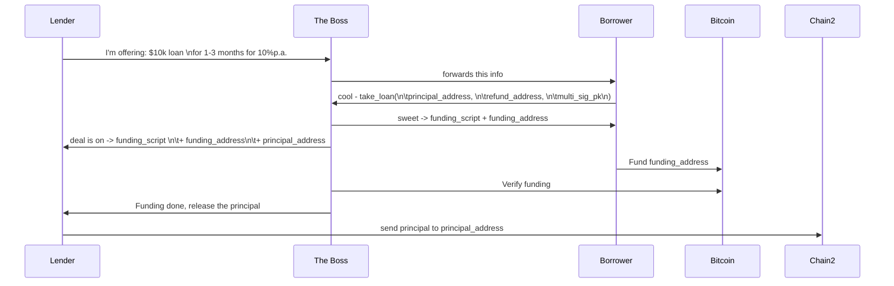
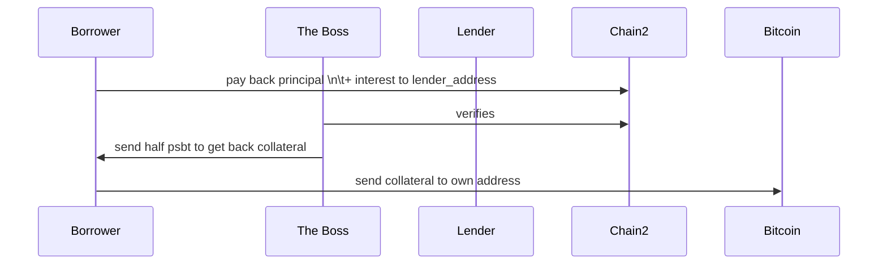

# Loan POC

## Take loan protocol

```mermaid
sequenceDiagram
    participant L as Lender
    participant T as The Boss
    participant B as Borrower

    L->>T: I'm offering: $10k loan \nfor 1-3 months for 10%p.a.
    T->>B: forwards this info
    B->>T: cool - take_loan(\n\tprincipal_address, \n\trefund_address, \n\tmulti_sig_pk\n)
    T->>B: sweet -> funding_script + funding_address
    T->>L: deal is on -> funding_script \n\t+ funding_address\n\t+ principal_address
    B->>Bitcoin: Fund funding_address
    T->>Bitcoin: Verify funding
    T->>L: Funding done, release the principal
    L->>Chain2: send principal to principal_address
```

## Pay back loan protocol

```mermaid
sequenceDiagram
    participant B as Borrower
    participant T as The Boss
    participant L as Lender

    B->>Chain2: pay back principal \n\t+ interest to lender_address
    T->>Chain2: verifies
    T->>B: send half psbt to get back collateral
    B->>Bitcoin: send collateral to own address
```
