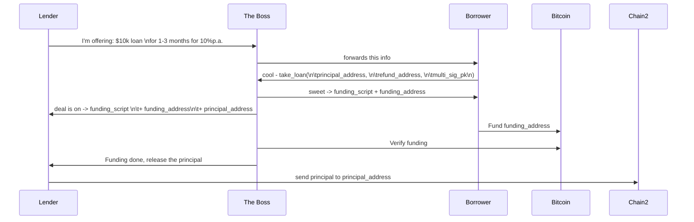
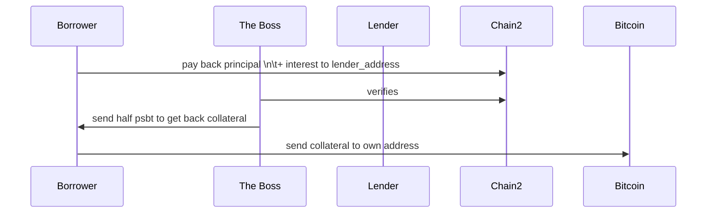

# Loan POC

## How to get started

We need `npm`, `just`, `rust` first.

For dev purposes we use [cargo-watch](https://crates.io/crates/cargo-watch).
use `just deps`, to install it.

### Dev run

Before you can run `the-boss`, you will need to make a copy of [./.env_sample](./.env_sample) and configure all variables.

Start `the-boss` and builds the frontend in one go and watch for file changes.

```bash
just watch-all
```

### DB changes

After you made some changes to the database or sqlx queries, make sure to run the command below. Make sure the database is running.

```bash
just db-prepare
```

### Postman: For local API development

For local API development we make use of [Postman](https://www.postman.com/downloads/).
A [postman.json](./Lendasat Postman Collection.postman_collection.json) file has been provided.

## Take loan protocol



## Pay back loan protocol


